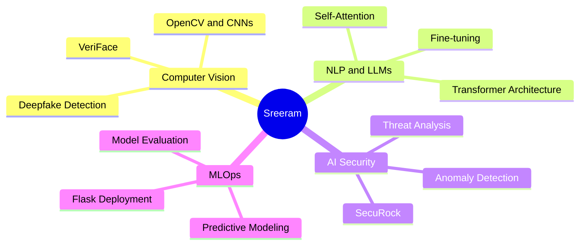
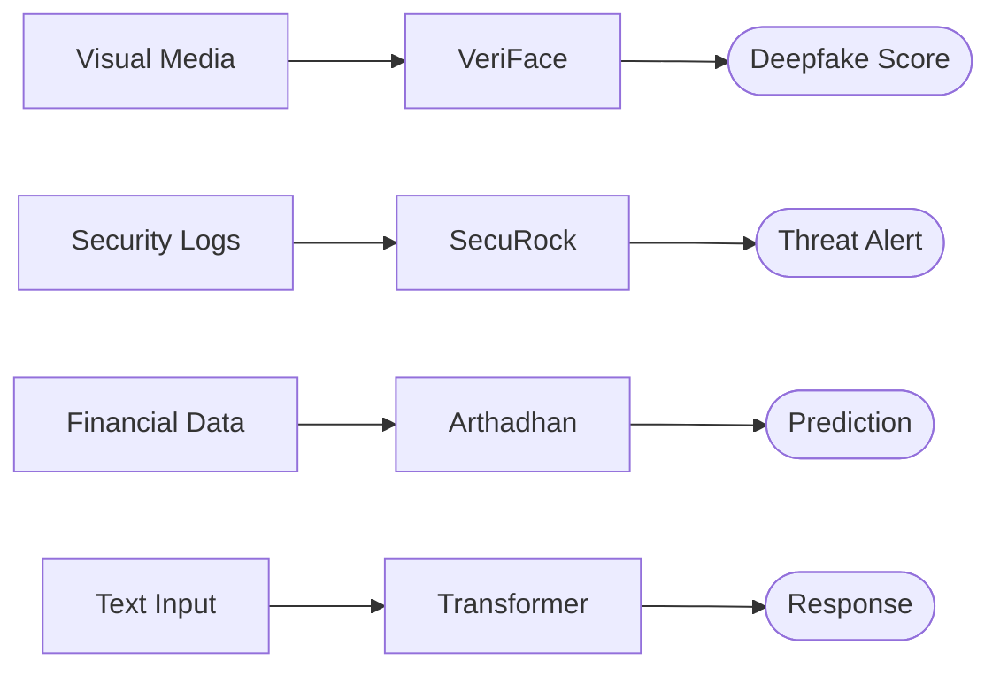

<div align="center">

# Sreeram M R
**AI Engineer · Computer Vision · NLP · Security**
B.Tech CSE 2027 · Thiruvananthapuram, Kerala

[](https://linkedin.com/in/sreeram4) &nbsp; [](mailto:sreerammurali2005@gmail.com) &nbsp; [](https://github.com/sreeram0343)

</div>

---

Building intelligent systems at the intersection of perception, language, and threat detection. **Google Vortexa Hackathon Winner** · Placement Ops Lead, 2026.

---

## Domain Architecture



---

## Projects

| Project | Domain | Description |
|---|---|---|
| **SecuRock** | AI Security | ML-based SOC platform — Vortexa Hackathon Winner |
| **VeriFace** | Computer Vision | Deepfake and AI-generated image classifier |
| **Arthadhan** | FinTech ML | Predictive financial analytics platform |
| **[Transformer Chatbot](https://github.com/sreeram0343/simple-transformer-chatbot)** | NLP | Self-attention architecture built from scratch |

---

## Technical Pipeline



---

## Stack

```
ML / DL    PyTorch · TensorFlow · Keras · scikit-learn
Vision     OpenCV · CNNs · Vision Transformers
NLP        Transformers · LLMs · Attention Mechanisms
Infra      Flask · NumPy · Pandas · Git · Linux
```

---

<div align="center"><i>Open to AI/ML internships and research collaborations.</i></div>
